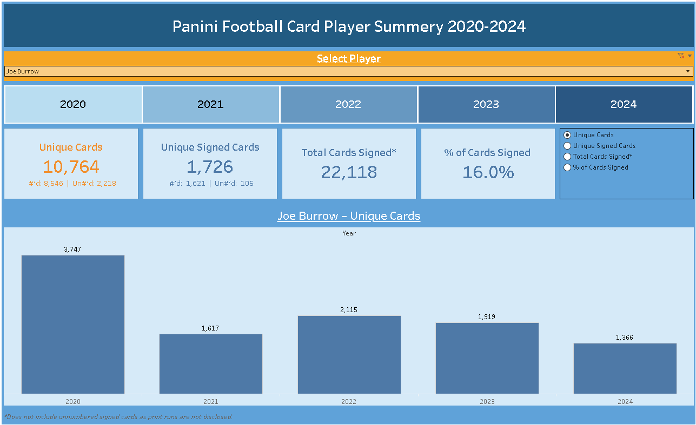
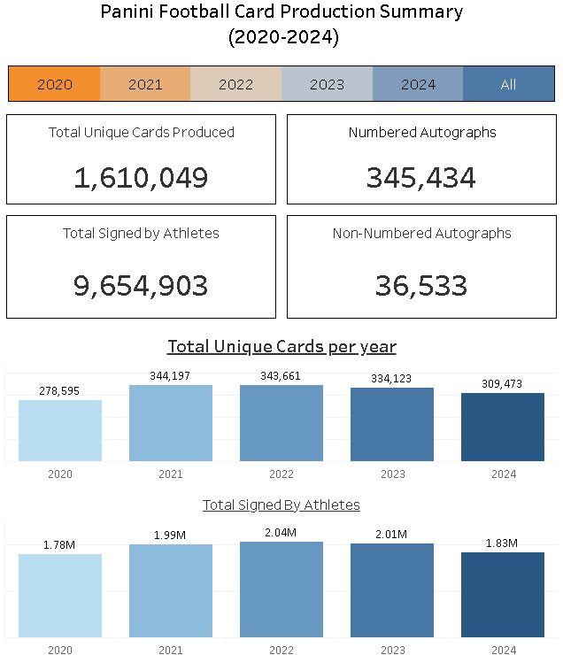

# Panini Football Card Analytics Dashboard

SQL + Tableau pipeline analyzing Panini football card checklists (2020–2024).  
This project cleans and normalizes raw Panini checklists, builds summary tables, and powers Tableau dashboards for year-level and player-level analysis.  
Tableau Public Profile: [jkselig](https://public.tableau.com/app/profile/jkselig)

---

## Repository Structure

```
panini-dashboard/
├── sql/                    # SQL pipeline scripts
│   ├── 01_create_tables.sql
│   ├── 02_clean_and_normalize_fixed.sql
│   ├── 03_summary_and_exports.sql
│   └── 04_eda_queries.sql
│
├── data/
│   ├── raw_sample/         # Example raw checklist (2020 only)
│   ├── processed_sample/   # Example processed checklist (2020 only)
│   └── exports/            # Final exports used by Tableau
│       ├── players.csv
│       ├── Player_level_dashboard.csv
│       └── panini_year_summary.csv
│
├── python/
│   ├── combine_checklists_by_year.py
│   ├── combine_all_years.py
│
├── tableau/
│   ├── Player_level_dashboard.twbx
│   └── Overall_summary_dashboard.twbx
│
├── docs/
│   ├── master_checklist.md
│   ├── data_dictionary.md
│   ├── data_sources.md
│   ├── architecture.md   # optional
│   └── screenshots/
│       ├── player_dashboard.png
│       └── year_dashboard.png
│
├── .gitignore
└── README.md
```

---

## Pipeline Overview

1. **Raw → Processed (Python)**  
   - Combine yearly raw Panini checklists → `processed_sample/{year}_master.csv`  
   - Combine all years → `processed_sample/panini_master.csv`

2. **Load to MySQL**  
   - Run `01_create_tables.sql` to create schema  
   - Use MySQL Workbench **Import Wizard** to load `panini_master.csv` into `panini_cards`

3. **Clean + Normalize (SQL)**  
   - Run `02_clean_and_normalize_fixed.sql`  
   - Deduplicates rows, splits multi-athlete cards, builds & links players

4. **Build Summaries (SQL)**  
   - Run `03_summary_and_exports.sql`  
   - Creates year, program, set, and player summary tables

5. **Exploratory Analysis (Optional)**  
   - Run `04_eda_queries.sql`  
   - Top players per year, top QBs, print run distributions

6. **Exports for Tableau**  
   - Export `players.csv`, `Player_level_dashboard.csv`, `panini_year_summary.csv`

7. **Dashboards (Tableau)**  
   - `Player_level_dashboard.twbx` → player-level view  
   - `Overall_summary_dashboard.twbx` → year/program/set trends

---

## Dashboards

- **Player-Level Dashboard**  
  - File: `tableau/Player_level_dashboard.twbx`  
  - Data: `Player_level_dashboard.csv` + `players.csv`  
  - Tableau Public: [View Online](https://public.tableau.com/views/PaniniPlayerSummery_Final3/Dashboard1?:language=en-US&:sid=&:redirect=auth&:display_count=n&:origin=viz_share_link)  
  - Preview:  
    

- **Overall Year/Program Dashboard**  
  - File: `tableau/Overall_summary_dashboard.twbx`  
  - Data: `panini_year_summary.csv`  
  - Tableau Public: [View Online](https://public.tableau.com/app/profile/YOUR_PROFILE/viz/Overall_summary_dashboard)  
  - Preview:  
    

---

## Data

- **Samples included in repo**  
  - `data/raw_sample/panini_checklists_2020_raw.csv` (23 MB)  
  - `data/processed_sample/panini_checklists_2020_processed.csv` (37 MB)  
  - Final exports in `data/exports/` (used in Tableau)

- **Full dataset**  
  - Combined 2020–2024 master (~205 MB) excluded from repo due to size  
  - Download via [Google Drive](https://drive.google.com/file/d/1AphuCNFdUUpgTVW3S1suG1-tJmZUU67u/view?usp=drive_link)

---

## Python

- `combine_checklists_by_year.py` → combines all raw checklists for a given year into `{year}_master.csv`  
- `combine_all_years.py` → stacks yearly masters into `panini_master.csv` (multi-year)  

> Requires `pandas`  

---

## Documentation

- [Master Checklist](docs/master_checklist.md) – step-by-step run order  
- [Data Dictionary](docs/data_dictionary.md) – schema & fields  
- [Data Sources](docs/data_sources.md) – raw sources, samples, full dataset link  

---

## Key Insights

- Thousands of unique Panini football cards analyzed (2020–2024).  
- Autographed cards account for a significant share, with QB rookies dominating.  
- Tableau dashboards allow filtering by player, year, program, and card set.  
